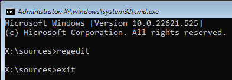

# Install Windows 11 as Guest OS on VMware Workstation

Purpose of this repository is to provide one way (of the many available in the Internet) to install Windows 11 as Guest OS on VMware Workstation, where either or both of the host machine's resources and/or the VMware version do ***NOT support*** [Windows 11 System Requirements](https://www.microsoft.com/en-in/windows/windows-11-specifications).


There are many guides which use script and/or binary tool which you need to download and execute, in order to install Windows 11 Guest OS ***without*** fulfilling the requirements.
However, from security perspective this MAY NOT be a good option since you MAY NOT trust those scripts and/or binary tools.
This repository provides a step by step procedure without needing external script or external binary tool.
All you need is the original installation `.iso` file from Microsoft.

<br><br><br>

The procedure on this repository were tested with the following components:
- [ ] Host: Windows 10 Home (version 22H2)
- [ ] Virtualization Technology: VMware Workstation Pro (version 15.5.7)
- [ ] Guest OS: Windows 11 Pro (version 22H2)

Note that both Microsoft and VMware keep updating their software, so when the versions you use differ, understandably you may stumble on error(s) not stated in this repository.

<br><br><br>

Download the Windows 11 `.iso` file from Microsoft's [Download Windows 11](https://www.microsoft.com/software-download/windows11) page.
The `.iso` file used for tests on this repository is the one stated on the table below:
| Language | SHA256 hash values for the `.iso` files |
| --- | --- |
| English International 64-bit | F115CD6B31734BC091BC94B964D5AD43984285BF229503481E2F7EF94AB7140E |

<br><br><br>

Once you have the Windows 11 `.iso` file, start to create the New Virtual Machine :


VMware Workstation 15 does not recognize Windows 11, so we have to use "Custom (advanced)" process.


Use Windows 10 as "template".


Since we are not going to comply with the Windows 11 Requirements; we'll use the ***practical*** firmware type BIOS.


Specify the CPU and Memory to be allocated for the new Windows 11 Guest OS, as needed or as available.
The procedure described in this repository will make Windows 11 installation bypass checking the amount of Memory and number of CPU cores and speed.


Detaching the new Windows 11 Guest OS from Internet is optional.
However I prefer to detach the new Windows 11 Guest OS while I am installing/configuring/removing the bloatware which Microsoft has put into the newly installed Windows 11 OS.
We can always re-attach the new Windows 11 Guest OS to the network/Internet later.


Once you reach the step depicted on the screen capture above, click `Finish` and the (still empty) Guest will be created.

<br><br><br>

Before you spin up the newly created (empty) Guest (i.e. before you start the Windows 11 OS installation process), you may want to review and change the virtual hardware configuration.
If you follow exactly the guide above to the letters, the name of the newly created Guest will be "Windows 11 Professional 64 Bits".
On the newly created "Windows 11 Professional 64 Bits" Guest, click on the `Edit virtual machine settings`.


If you do not have virtual "Printer" configured, you can remove this virtual device from the "Windows 11 Professional 64 Bits" Guest.
Select the "Printer", click `Remove` button below, and then click `OK`.

Whether you have or not have the virtual "Printer" configured, this step is optional.
Removing the virtual "Printer" will prevent VMware from poping up messages regarding the virtual "Printer".


On "Options" tab and "Advanced" menu, you can have VMware to "Clean up disks after shutting down this virtual machine".
This is a nice feature to utilize, to auto-maintenance the Guest's disks after each shutdown, so the disks won't get bloated in size and waste storage spaces.


<br><br><br>

After you're done reviewing and/or changing the virtual hardware configuration, click `Power on this virtual machine` to turn-on "Windows 11 Professional 64 Bits" Guest.


On the VMware's console you see the Windows 11 installer starts.
Select the proper options to install your instance of Vindows 11 VM.


Click the "Install now" button.


Input your Windows 11 License/Product Key, or click the "I don't have a product key".


Select the Windows 11 OS type, in sync with the License/Product Key that you have above.


You'll see a message "This PC can't run Windows 11" and the installation is blocked due to lack of resources or missing hardware requirements.


When you see the above message, press `shift`+`F10` (or `shift`+`fn`+`F10`) on your keyboard at the same time to launch a command prompt.
At the command prompt, type `regedit` and press `enter` to launch the Registry Editor.


When the Registry Editor opens, navigate to `HKEY_LOCAL_MACHINE\SYSTEM\Setup`, right-click on the `Setup` key and select `New` > `Key`.
When prompted to name the key, type `LabConfig` and press `enter`.
- [ ] Right-click on the `LabConfig` key, select `New` > `DWORD (32-bit)`, create a value named `BypassTPMCheck`, and set its data to `1`.
- [ ] Right-click on the `LabConfig` key, select `New` > `DWORD (32-bit)`, create a value named `BypassSecureBootCheck`, and set its data to `1`.
- [ ] Right-click on the `LabConfig` key, select `New` > `DWORD (32-bit)`, create a value named `BypassRAMCheck`, and set its data to `1`.
- [ ] Right-click on the `LabConfig` key, select `New` > `DWORD (32-bit)`, create a value named `BypassStorageCheck`, and set its data to `1`.
- [ ] Right-click on the `LabConfig` key, select `New` > `DWORD (32-bit)`, create a value named `BypassCPUCheck`, and set its data to `1`.

Refer to below screen capture as final result of editing the registry.


Close/exit the Registry Editor.
To close/exit the command prompt, type `exit` and press `enter`.



At the window which displays message "This PC can't run Windows 11", click the `<-` (back arrow) on the top left of the window.
You will be back to "Select the operating system you want to install" window.
Click `Next` button on the bottom right of the window.
You will advance to the following window.


The installer will reboot/restart the VM instance.
After a while, the installer will continue with the following screen.


At this stage, installation is blocked because the VM instance does NOT have Internet connection.


Press `shift`+`F10` (or `shift`+`fn`+`F10`) on your keyboard at the same time to launch a command prompt.


At this point, you have option for example to change the screen size, by typing `utilman` at the command prompt, which will launch the System's Settings.


If you do want to try the option to change the screen size, on the launched "System's Settings" click/select `System` at the left column menu, then click/select `Display` on the right side, and then choose the `Display resolution`.
The `utilman` or "System's Settings" is optional at this point.


To be able to advance further without Internet connection, at the command prompt type `oobe\bypassnro`.
Note that this command will reboot/restart the VM instance.


Once the reboot/restart is done, you will be back to the "Is this the right country or region?" screen/window.
Just proceed to repeat those previous screens/windows.
This time around on the "Let's connect you to a network" screen/window you'll have option to choose "I don't have internet".


Choose/click the "Continue with limited setup".
The rest of screens/windows are usual account creation configurations/queries.


Disable/turn-off (No) to ALL items on this screen/window.


Et voilà, now you have the Windows 11 Guest OS, without fulfilling the Windows 11 Requirements.


<br><br><br>

***

<br><br><br>

References:
- [ ] [Installing Windows 11 as a Guest OS on VMware Workstation](https://kb.vmware.com/s/article/86207)
- [ ] [Force-Windows-11-Install](https://github.com/JosephM101/Force-Windows-11-Install)
- [ ] [How to enable TPM and Secure Boot on VMware to install Windows 11](https://pureinfotech.com/enable-tpm-secure-boot-vmware-install-windows-11/)


<br><br><br>

***

<br><br><br>
```
╔═╦═════════════════╦═╗
╠═╬═════════════════╬═╣
║ ║ End of Document ║ ║
╠═╬═════════════════╬═╣
╚═╩═════════════════╩═╝
```
<br><br><br>


